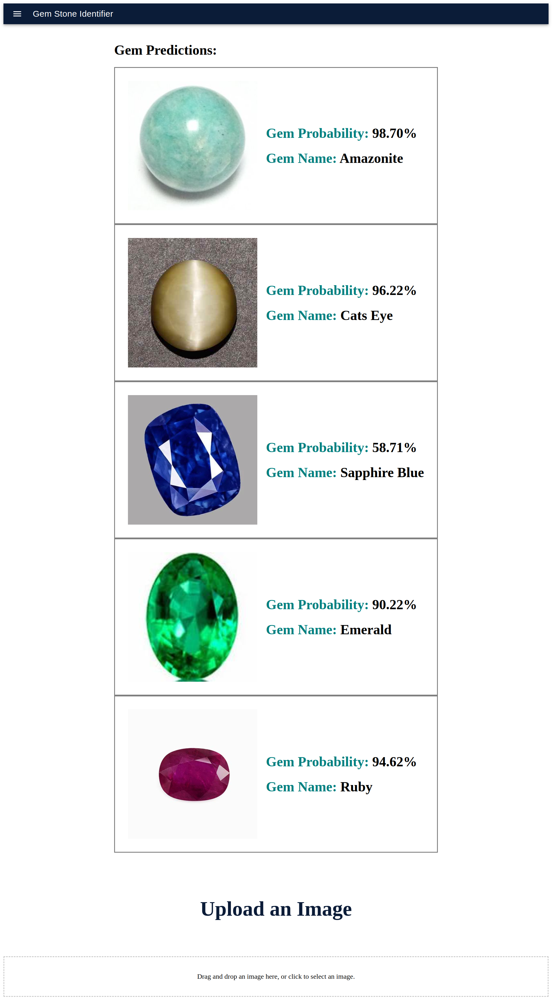

# GemStoneClassification
<h2>Gemstone Classification AI Model 💎✨</h2>

This repository contains a sophisticated gemstone classification AI model developed using Convolutional Neural Networks (CNNs). The model leverages the powerful feature extraction capabilities of CNNs to accurately classify various gemstones.

<h3>Key Features:</h3>
<ul>
  <li><strong>Feature Extraction with CNNs</strong> 🔍📊: The beauty of CNNs lies in their ability to automatically extract important features from images, reducing the need for manual feature engineering.</li>
  <li><strong>Efficient Image Classification</strong> 📸🔠: Utilizes dense layers of neurons for effective image classification, ensuring high accuracy in distinguishing between different types of gemstones.</li>
  <li><strong>Complexity Reduction with Pooling</strong> 🧠🔄: Unlike Artificial Neural Networks (ANNs) that treat every pixel with equal importance, CNNs employ pooling to reduce complexity. This technique focuses on essential features, minimizing the number of neurons and their associated weights.</li>
</ul>

Explore the power of CNNs in gemstone classification with this model! 🚀💡

<h3>Sample Image</h3>

  

<h3>How to Run It 🛠️💻</h3>

First of all, download the backend which is named <strong>django_setup</strong> and the frontend which is named <strong>AI_GemStone_Detection</strong>. After downloading the backend, you need to have the <strong>myenv</strong> file (which includes all the essential libraries). The step-by-step commands to download that are given below:

<h3>Ensure Virtual Environment is Created:</h3>
<pre><code>python -m venv myenv</code></pre>

<h3>Activate the Virtual Environment:</h3>

<strong>Windows:</strong>

<pre><code>myenv\Scripts\activate</code></pre>

<strong>macOS/Linux:</strong>

<pre><code>source myenv/bin/activate
</code></pre>

With the virtual environment activated, install the dependencies from <code>requirements.txt</code>:

<pre><code>pip install -r requirements.txt</code></pre>

Finally, run the Django server:

<pre><code>python manage.py runserver</code></pre>

<h3>Setting Up the Frontend 🖥️⚙️</h3>

For the frontend, navigate to the <strong>AI_GemStone_Detection</strong> directory and install the necessary Node.js modules:

<pre><code>npm install</code></pre>

After the installation is complete, run the frontend development server:

<pre><code>npm run dev</code></pre>
